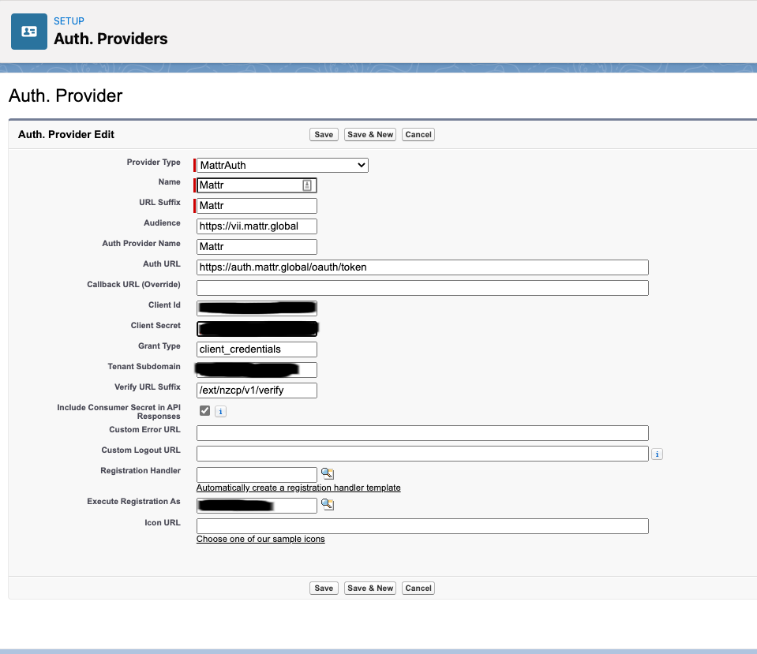
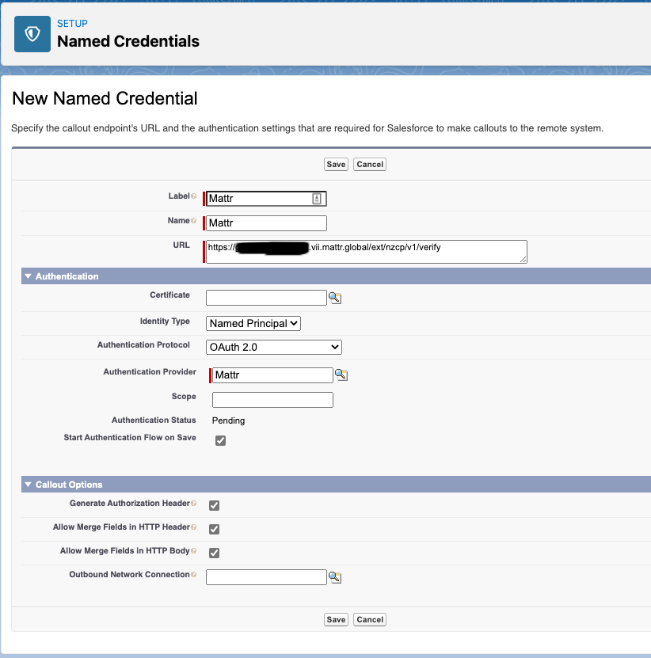

# Mattr Auth Provider & Verifier Invocable Method
=================================================

A Salesforce custom [Auth Provider](https://help.salesforce.com/articleView?id=sso_authentication_providers.htm&type=5) & [Invocable Method](https://developer.salesforce.com/docs/atlas.en-us.234.0.apexcode.meta/apexcode/apex_classes_annotation_InvocableMethod.htm) for the Mattr NZ "My Vaccine Pass" verification API

# Overview
----------

This project provides both an example Auth Provider for Authenticating with the Mattr Verification API as well as an Invocable method that can be used to pass a scanned QR code to the API for verification

## Getting Started
------------------

1. Sign up for a Free [MATTR VII Trial Account](https://mattr.global/get-started/)
2. Sign up for a Free [Salesforce Developer Org](https://developer.salesforce.com/signup) or create a new Scratch Org
3. Install the package by:
   a. Installing the unmanaged package in your salesforce via the link below or [TODO](www.todo.com)
   b. Downloading this repo and pushing a copy of it to a scratch org you've previously created or the new Developer Org you created above using 'sfdx force:source:push'
4. Create a new `Auth. Provider` using the following details, along with the information you received from Mattr with your new test credentials:
   - **Provider Type**: `MattrAuth`
   - **Name**: `Mattr`
   - **URL Suffix**: `Mattr`
   - **Audience**: `vii.mattr.global`
   - **Auth Provider Name**: `Mattr`
   - **Auth URL**: `https://auth.mattr.global/oauth/token`
   - **Client Id**: Provided as part of the Mattr Signup process
   - **Client Secret**: Provided as part of the Mattr Signup process
   - **Grant Type**: `client_credentials`
   - **Tenant Subdomain**: Provided as part of the Mattr Signup process
   - **Verify URL Suffix**: `/ext/nzcp/v1/verify`
   - **Execute Registration As**: This should be your username
   
5. Create a new `Named Credential` using your specific subdomain and appending the verification suffix on the end of it. This should be in the format: **https://**`Tenant Subdomain`**.vii.mattr.global/ext/nzcp/verify**.  Ensure that "Start Authentication Flow on Save", "Allow Merge Fields in HTTP Header" and "Allow Merge fields in HTTP Body" are ticked
   - **Label**: `Mattr`
   - **Name**: `Mattr`
   - **URL**: In the format https://`Tenant Subdomain`.vii.mattr.global/ext/nzcp/v1/verify
   - **Identity type**: `Named Principal`
   - **Authentication Protocol**: `Oauth2`
   - **Authentication Provider**: `Mattr`
   - **Start Authentication Flow on Save**: [x]
   - **Generate Authorization Header**: [x]
   - **Allow Merge Fields in HTTP Header**: [x]
   - **Allow Merge Fields in HTTP Body**: [x]
   
   After saving, the Authentication Status should be updated from `Pending` to `Authenticated as **random string**@example.com`
6. You're all set you should now be able to verify an NZ Covid Pass using the included Invocable Method

From here the best way to test this is probably to install a QR Code / Barcode Scanner, I ended up using this one by one of my colleagues', [John Meyer](https://github.com/johnsfdemo)
The Invocable method was really developed to be used in Flow as either part of a screenflow or triggered process, but could just as easily be called from APEX

## Other Install Options
------------------------

Although the code is all provided here, you can also use [TODO](https://todo.com) to load this into your org

## Contributors
---------------
Special thanks to the Gravity Lab team for their help, specifically

 - [Mike Cleaver](https://github.com/Mickster04) - General code updates, testing and specifically the file upload callout
 - [David Smith](https://github.com/DavidSmithnz) - Coordination, testing and error checking

